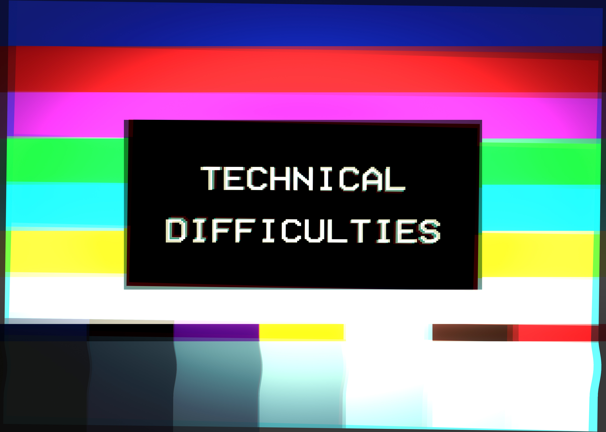

```{r setup, include=FALSE}
# A University of Arizona theme for Xaringan RMarkdown slide decks

# Based on [Garth Tarr's `sydney_xaringan` theme](https://github.com/garthtarr/sydney_xaringan), itself based on the original [xaringan](https://github.com/yihui/xaringan) theme by Yihui Xie.

# Fonts, colors, and other assets from [brand.arizona.edu](https://brand.arizona.edu). Please note that _Proximia Nova_ is a licensed font that should only be used with permission, so is not included here. Instead, MiloWeb is used.

knitr::opts_chunk$set(echo = FALSE, message = FALSE, warning = FALSE)
options(htmltools.dir.version = FALSE)
library(xaringan)
library(xaringanExtra)
library(DT)
library(kableExtra)
library(tidyverse)

# Xaringan extras
xaringanExtra::use_scribble()     #<< turns on Scribbling

# Code highlighting on over
xaringanExtra::use_extra_styles(
  hover_code_line = TRUE,         #<<
  mute_unhighlighted_code = TRUE  #<<
)
# xaringanExtra::use_slide_tone() # unmute when publishing

# Turns on clipboard options. Great for giving code to students.
htmltools::tagList(               # # turns on the clipboard option
  xaringanExtra::use_clipboard(
    button_text = "<i class=\"fa fa-clipboard\"></i>",
    success_text = "<i class=\"fa fa-check\" style=\"color: #90BE6D\"></i>",
    error_text = "<i class=\"fa fa-times-circle\" style=\"color: #F94144\"></i>"
  ),
  rmarkdown::html_dependency_font_awesome()
)

# Editable slides
xaringanExtra::use_editable(expires = 1)
```

# Today's schedule

.pull-left[

+ Intros
+ What is postphenomenology?
+ Why is it relevant to us?
+ How do you *do* it?

## Questions during?

## Ask away!

]

.pull-right[

<div style="width:100%;height:0;padding-bottom:100%;position:relative;"><iframe src="https://giphy.com/embed/ZbOXZEugwT26awakGe" width="100%" height="100%" style="position:absolute" frameBorder="0" class="giphy-embed" allowFullScreen></iframe></div><p><a href="https://giphy.com/gifs/latenightseth-lol-seth-meyers-lnsm-ZbOXZEugwT26awakGe">via GIPHY</a></p>

]

???

Welcome! I applaud you for joining the session, especially if you've never heard of postphenomenology since it's not exactly the most welcoming word (in fact, the scholar who coined it wishes he'd picked something else). If you think of yourself as a bit of a tech nerd, you are so in the right place.

The plan for today is as such. A bit about me and why I've got you here, what this whole concept is, why it's relevant to us, and then... how you actually quote-unquote "do" it. Because postphenomenology is both a framework for understanding how people, technology, and the world co-create our perceptions but also a methodology for how to empirically examine that relationship and experience.

To be honest, you may recognize some of the concepts we're talking about today. You may know them or versions of them as different terminology in other frameworks and methodologies. And that's okay! That's really what today is going to be about: providing you with another toolbox with some tools that are brand new, and some old tools that you'll be looking at in--hopefully--a new way.

Of course, if you have questions or comments during the session, please don't hesitate to put them in the chat or raise your hand. Perhaps I can answer them, and if I can I will, but my goal here is not to provide a step-by-step on how to do this particular thing, but rather to get you, this community, to ask questions. So, on with the show!

---
class: secondary-silver
background-image: url("assets/ua_horiz_rgb_black_4.svg")
background-size: 20%
background-position: 95% 95%

# Introductions

.font150[`r anicon::faa("user-check", animate="pulse", speed="slow")`]

---

# Dr Ryan Straight

.pull-left[.center[

```{r ryan, out.width="75%"}
knitr::include_graphics("https://mavrxlab.org/author/ryan-straight/avatar_hu1391b7b60d37d3770aa9cbe976f23932_26316_270x270_fill_q75_lanczos_center.jpg")
```

]]

.pull-right[

+ Dog dad
+ Photographer
+ Total nerd
+ Life-long educator
+ Areas of interest:
    + Extended reality
    + Philosophy of technology
    + Postphenomenology (that's us!)

]

.pull-down[

.center[

## Full contact info on the closing slide!

]

]

---
class: secondary-river
background-image: url("assets/ua_horiz_rgb_4.svg")
background-size: 20%
background-position: 95% 95%

# What is Postphenomenology?

.font150[`r anicon::faa("question", animate="pulse", speed="slow")`]


???

I'll be giving a brief overview of what PP is and where it comes from, but the majority of the work in terms of "doing" PP and its integration into this education space actually comes from the work of Catherine Adams and others. So, using her definition, postphenomenology is:


--

"[a] phenomenology that attends to specific technologies and the existential and epistemological differences they may be making to the lifeworld" (Adams & Turville, 2018, p.4).

???

>"phenomenology that attends to specific technologies and the existential and epistemological differences they may be making to the lifeworld" (Adams & Turville, 2018, p.4).

And we'll unpack that as this session goes on and you'll have access to a collection of references and resources involved in this topic. But first, how did we get from traditionally phenomenology to ... this?

---
class: brand-blue

# A **brief** history of postphenomenology

.pull-left[

+ Directed and intentional relation with world
+ Tech isn't *interfering*, it's *mediating*
+ "Post" as in "postmodern"
+ Don Ihde
+ Formulated technic relations
+ Multistability, transparency.
+ ANT


]


.pull-right[

## The necker cube: variational analysis

```{r necker}
knitr::include_graphics("https://upload.wikimedia.org/wikipedia/commons/e/e7/Necker_cube.svg")
```

.font40[Source: Wiki Commons: https://commons.wikimedia.org/wiki/File:Necker_cube.svg]

]
...

???

This is going to be very brief because I'm going to dig into most of this more throughout the session, so if something doesn't quite make sense yet, just hang on.

+ First, phenomenology. And when I say "brief," I mean *super* brief. 
    + Essentially, if you recall from your days taking philosophy 101, phenomenology is a framework for understanding consciousness and our place in the world by understanding that consciousness is always *directed* or *intentional*. The old "you can't think of nothing" idea. In order to quote-unquote "do" phenomenology, the researcher must remove all prejudice and intefering preconceptions about the thing they're studying to focus on, as Husserl puts it, "The things themselves."
+ Ihde
    + Then Don Ihde comes along and says, "Hang on, this whole phenomenology thing should make this a bit more pragmatic. Now we have all this technology that doesn't *intefere* with how we see and experience the world, it actually *mediates* that experience! And we should study that, not put it aside!"
    + So he comes up with a new, call it "modern" version of phenomenology, and appends "post" to it, not to say it's the successor, but to point out that it's acknowledging the 20th century "empirical turn."
    + He writes a text called *Technology and the Lifeworld*, in which he outlines the basic tenets of the new postphenomenological framework. It's not perfect but it gets the conversation started.
+ Verbeek and others
    + Scholars begin studying under Ihde and coming up with their own improvements on and variations of the framework. Verbeek, for example, begins focusing on a theory of technological mediation specifically, while others begin incorporating it into their own fields of interest like the study of medical assistive devices or, again in Verbeek's case, studying a la Husserl, "things, themselves" like park benches.
+ Actor Network Theory
    + Related to postphenomenology is Actor Network Theory, typically attributed to Bruno Latour, which focuses on objectivity and subjectivity being co-constructed by the "actors" within a "network." So, a person and a chair aren't subjects or objects until they interact, at which point their positionality is established. Essentially. These networks can and do shift, so ANT is a framework and methodology for examining this. I mention it here because it's related to postphenomenology in that the latter informs the former with the ability to examine things, as Verbeek puts it, "from inside out."
+ That brings us to applied postphenomnology, or Adams' "postphenomenology of practice," as her specific version is based on the phenomenological work of Van Manen, whom she studied under.
    + I *highly* encourage you read the work I link in the resources and references if this is piquing your interest. It's really fascinating. Adams' work, especially. This is how we're quote-unquote "doing" postphenomenology in our particular case. And we'll come back to that.
  

---
class: secondary-silver
background-image: url("assets/ua_horiz_rgb_black_4.svg")
background-size: 20%
background-position: 95% 95%

# Terminology

.font150[`r anicon::faa("quote-left", animate="pulse", speed="slow")`]


???

So we've got our basic background of this framework but let's dig into the specific terminology a bit more before we start talking about how we can use it. Listen closely as there will be a quiz. :D


---
class: brand-red

## Technological mediation

> Technology *necessarily* mediates our experience with the world.

???

When we think of how we interact with the world, in classical phenomenology, as I briefly mentioned just a minute ago, we're encouraged (required, in fact) to "block" or otherwise attempt to eschew all elements of the lifeworld that can interfere with our experience to get to the root of the thing. PP says, no, technology (as we experience it now) shouldn't be dismissed or considered a hindrance but rather something to be empirically studied. And we'll look at just how postphenomenologists like Ihde typically envision this in just a little bit.

--

## Multistability

> Things have more than one use, technology especially.

???

Think of a hammer. It can be a construction tool, a paperweight, or a weapon. Don't confuse this with *convergence*, for example with a phone now being a GPS, a camera, and so on, as these various technologies have converged into one. No, here we're talking about a technology that is built for one thing but has various (multiple) different possibly unintended functions. 

The Necker cube, for example. You can see it one way, then you can see it another, but the thing itself doesn't change. It's simply how you're perceiving it and its existence in the world. 

--

## Transparency

> When technology fades from "view."

???

If you're thinking of Heidegger and recall this from your philosophy of technology days, bravo!  the hammer is a tool but becomes something else entirely when it breaks. When it's functioning, though, a sense of embodiment arises and the hammer and hammer user become one. Like an air conditioner: you don't really think much about it until it doesn't work. If you're a gamer, think of this as the controller: eventually you stop feeling that technology as something opaque between you and the screen. 

This is somewhat related to another topic: embodiment. That is, through our habits and repeated use of a technology, the line between subject and object begins to blur. Think of a master painter and a brush, or a virtuoso violinist and their instrument; they very nearly become *one*.

And this leads us to the fun stuff: technic relations.

---
class: secondary-river
background-image: url("assets/ua_horiz_rgb_4.svg")
background-size: 20%
background-position: 95% 95%

# Technic Relations

.font150[`r anicon::faa("users-cog", animate="pulse", speed="slow")`]


???

The real goal of all this--and, hopefully, why you're here--is to discuss just how we relate to the world through, because of, and maybe even sometimes *in spite of* technologies.

So I'm going to run through the original four really quick. These were outlined in Ihde's "Technology and the Lifeworld." I'll then very briefly point out the newer relations that have come about since these as technology has advanced.

---
class: brand-blue

# Embodiment

.pull-left[

> `(human - technology) -> world`

People and technology together relate to the world.

+ You see **through** a telescope.
+ You talk **through** a phone.
+ There is technologic **transparency**.

]

.pull-right[

<div style="width:100%;height:0;padding-bottom:100%;position:relative;"><iframe src="https://giphy.com/embed/gIxBtRsuxT0iWuBDY4" width="100%" height="100%" style="position:absolute" frameBorder="0" class="giphy-embed" allowFullScreen></iframe></div><p><a href="https://giphy.com/gifs/planets-telescope-mastertingus-gIxBtRsuxT0iWuBDY4">via GIPHY</a></p>


]

???

...


---
class: brand-blue

# Hermenutic

.pull-left[

> `human -> (technology - world)`

+ You **read off** a speedometer.
+ We **interpret** an x-ray.
+ We assume the translation is accurate.


]

.pull-right[

<div style="width:100%;height:0;padding-bottom:100%;position:relative;"><iframe src="https://giphy.com/embed/zt0ZkDZXMEOS4" width="100%" height="100%" style="position:absolute" frameBorder="0" class="giphy-embed" allowFullScreen></iframe></div><p><a href="https://giphy.com/gifs/trippy-person-knee-zt0ZkDZXMEOS4">via GIPHY</a></p>


]

???

...


---
class: brand-blue

# Alterity

.pull-left[

> `human -> technology (world)`

+ Technology as **other**.
+ We're in **its** system, not ours.
+ World **withdraws**; we focus on the **technology**.

]

.pull-right[

<div style="width:75%;height:0;padding-bottom:129%;position:relative;"><iframe src="https://giphy.com/embed/VVAiHiDKeUHC0" width="100%" height="100%" style="position:absolute" frameBorder="0" class="giphy-embed" allowFullScreen></iframe></div><p><a href="https://giphy.com/gifs/digital-evolution-amazon-VVAiHiDKeUHC0">via GIPHY</a></p>


]

???

...


---
class: brand-blue

# Background

.pull-left[

> `human -> (technology / world)`

+ Impacts our **environment**.
+ Through this, **us**.
+ Often don't notice until it **breaks**.

]

.pull-right[

<div style="width:100%;height:0;padding-bottom:100%;position:relative;"><iframe src="https://giphy.com/embed/Rf4SBc9erYPaLlOA0U" width="100%" height="100%" style="position:absolute" frameBorder="0" class="giphy-embed" allowFullScreen></iframe></div><p><a href="https://giphy.com/gifs/summer-drip-ac-unit-Rf4SBc9erYPaLlOA0U">via GIPHY</a></p>


]

???

The air conditioner we talked about. 

---
class: brand-red

# The Next Generation

## Fusion

> (I / Technology) -> World

???

Here we start getting into more complex relations that you can imagine being used in cutting-edge or future online/virtual learning environments. Hopefully you're beginning to see where I'm going with all this.

First, fusion. Here we're talking about everything from IUDs to pacemakers, from implanted RFID chips to cochlear implants. In this case, there is no physical separation of the self and the technology. In fact, removing one of them from the equation breaks the entire thing down. A pacemaker without a user has no impact, and a user without a pacermaker is... well. You get the point. The person and the technology are literally **fused** insofar as experiencing the world is concerned.

--

## Immersion

> I <-> Technology/World

???

This is reflexive technology. A "classic" example of this is a "smart mirror" you could find at a doctor's office. You look in the mirror but there's also a camera behind it that, using facial recognition, connects to your medical record and displays your vital statistics, information about your lifestyle, or even something like that at home that displays your daily schedule or mean plan for the day. Perhaps, in the case of the doctor's office, it will use algorithmic software to show you what you'll look like in five, ten, fifteen years if you continue your current health trends. Whatever the case may be. So you experience the world that's enmeshed with the technology, and the technology, being reflexive, reacts to you as much as you react to it. Hence this kind of bidirectionality. (Example from "Verbeek's theory of technological mediation" in FutureLearn.) 

--

## Augmentation

> (I-Technology) -> World -> (Technology-World)

???

Told you we're getting complex! I'm sure you've used some sort of augmented reality application or tool, from Pokemon Go to maybe a HoloLens. In this case, a second layer of reality is overlayed on the one you're experiencing, and both you *and the tool* react to that. This is often called a "bifurcated" representation, as you're now seeing two different aspects of the world simultaneously.

Hopefully, you're beginning to think about just how this framework is starting to make sense when it comes to your online learning toolbox. I want to really start digging into that now, but first, time for a little thought experiment. I want you to imagine a typical online student, however they may look.

---
class: secondary-silver
background-image: url("assets/ua_horiz_rgb_black_4.svg")
background-size: 20%
background-position: 95% 95%

# Thought experiment

.font150[`r anicon::faa("flask", animate="pulse")`]


???

Do you have it in your mind? Picture everything. The chair, the desk, the laptop or PC, the ambient sounds, the temperature, the lighting. Now picture what kind of LMS is coming through the screen. Is it responsive? Think about the PDF the student is reading on the screen: is it OCR friendly? 

Think about all these things and start categorizing them into the different relations: the mouse and keyboard are quote "part of" the student, so the embodiment relation is occurring. The way the course is designed is unfamiliar, so there's some breakdown in the hermeutic relation as the student tries to interpret what's presented. Perhaps the room is too cold or there's the hum of other machines nearby, so the background relation is impacting the student's ability to concentrate.  

And so on. 

And what about when the student is in a synchronous online class, like via Zoom?

Zoombie?

---
class: secondary-river

# Ways to "Do" Postphenomenology

.font150[`r anicon::faa("check", animate="pulse")`]


???

Here we get into ways to actually "do" this kind of analysis. Much of PP focuses on the technological objects and, more or less, "inteviewing" them. Really getting to how they act as that mediator. But, in online learning, we're focused on more than just the device and the LMS design, right? 

This goes back to Adams and Turville's piece that I quoted at the very beginning. They describe four basic methods of "doing" postphenomenology, what  especially for the online learning space. Their "postphenomenology of practice."

---

# Option 1: The Prereflective

>Composing Anecdotes through Self-Oberservation (Phenomenological Protocol Writing)

```{r option1stock, out.width="55%", fig.align='center'}
knitr::include_graphics("./assets/option1.jpeg")
```

.footnote[

[Image via Adobe stock](https://stock.adobe.com/images/woman-sitting-with-her-legs-up/340808447?prev_url=detail)

]

???

"A first way," according to them, "to generate data for a postphenomenological investigation is to attend to one's own lifeworld." Quoting van Manen, "Our personal life experiences are immediately accessible to us in a way that no one else's are."

The phenomenological experience that Ihde used (and which is often referenced in this space) is that of using chalk on a chalkboard. He points out that "I experience the roughness of the board at the end of the chalk.... What I feel is felt locally at the end of the chalk, or better, at the chalk-blackboard junction."

And there's our "enigma point!" So, first-person description, truly being aware of what all is happening and you're experiencing, and using the quote "language of (insert activity here)." Record your own experience in the process and examine it critically. 

---

# Option 2: The Prereflective

>Gathering Lived Experience Descriptions through Interviews

```{r option2stock, out.width="55%", fig.align='center'}
knitr::include_graphics("./assets/option2.jpeg")
```

.footnote[

[Image via Adobe stock](https://stock.adobe.com/images/businesswoman-interviewing-male-job-candidate-in-seating-area-of-modern-office/281053075?prev_url=detail)

]

???

Their second option is to "conduct interviews with those who have experience with **the technology-textured phenomenon in question**." It's so much more than a usability study or a UX questionnaire. You're using this to generate quote "a rich and diverse body of first-hand examples of everyday human-technology-world engagements." And this isn't easy! If you've done any interviewing, say for a grad school thesis, you know that it's as much an art as it is a science. That said, it's crucial. The authors use an example of investigating the experience of teaching with PowerPoint:

+ Can you think back to the last time you taught with PowerPoint
+ Recalling that particular class, can you walk me through what happened, perhaps beginning with when you arrived and opened your Powerpoint?
+ Do you have a particular moment that stands out when you were teaching with Powerpoint?
+ Where were you?
+ What happened?

And so on. 

---

# Option 3: The Prereflective

> Composing Anecdotes through Observation of Others

```{r option3stock, out.width="55%", fig.align='center'}
knitr::include_graphics("./assets/option3.jpeg")
```

.footnote[

[Image via Adobe stock](https://stock.adobe.com/images/recruiter-observing-job-applicant-s-task-management-skills-at-a-job-interview/185416243?prev_url=detail)

]

???

This is a popular method of data generation and is especially used within PP, especially in education. Why? Because it allows you to identify aspects of an experience that the subject may actually not even be aware of. Sure, you don't get access to their thoughts and self-reported observations, but you can get much more, if different, information.

The authors point out: "it is ultimately not the researcher, but the students, who are best positiond to describe how the world of the classroom and the science experiemnt [for example] appeared to them, that is, the intelligibility of the event to each individual, what material aspects of the experiment showed up as meaningful to them, and so on. Here, a PP of Practice necessarily returns, not only to the things themselves, but also to the students themselves.

Ihde calls it "phenomenological looking." All the more important to consider when technology breaks or malfunctions: this can often tell you more than when it works well.

---

# Option 4: The Reflective

> Studying Breakdowns and the Eidetic Reduction

```{r option4stock, out.width="55%", fig.align='center'}

```

.footnote[

[Image via Adobe stock](https://stock.adobe.com/images/the-text-technical-difficulties-inside-a-black-box-over-an-old-television-test-screen-horizontal-color-bars/358950809?prev_url=detail)

]

???

The "eidetic reduction... recognizes that eery phenomenon obtains its unique identity via its differences from other related phenomenon. A phenomenon is originally constituted and marked by what it is **not**." This is used to uncover those "multistabilities" we talked about: what about it is unique or "invariant" and cannot be reduced any futher? 

That breakdown--the tech, the person, a relationship, you name it--"provides a reliable way of surfacing our otherwise taken-for-granted, co-constitutive relations with technologies and thus make them available for inquiry."

---
class: secondary-river
background-image: url("assets/ua_horiz_rgb_4.svg")
background-size: 20%
background-position: 95% 95%

# Postphenomenology in Education

.font150[`r anicon::faa("graduation-cap", animate="pulse", speed="slow")`]


???

Specifically with technologically dependent education (and, I argue, online learning), "postphenomenolgoical studies and insight may serve in promoting more critically circumspace applications of different technologies in pedagogical settings, and in advancing a long-overdue revision to our taken-for-granted assumptions and practices with technology in education."

In short, "by applying postphenomenological concepts to concrete instances of human-technology relations, the advantages, disadvantages, limits, and places of potential expansion and enrichment can be identified."

This "(post)phenomenology of practice" provides another approach... that leans heavily on its phenomenological roots while providing a stable methodological ground for conducting empirical postphenomenological studies in education."


<!-- Ending slide below -->
---
class: arizona-cool
background-image: url(assets/ua_horiz_rgb_4.svg)
background-size: 260px
background-position: 5% 95%

# Thank you!


.font150[ You can find references and readings on the MAVRX Lab's event page at:]

.font170[https://mavrxlab.org/event/ac21/]

.pull-left[

Contact info:

Dr. Ryan Straight  
Assistant Professor of Practice in Applied Computing and Cyber Operations  
College of Applied Science and Technology  
Universtiy of Arizona  
ryanstraight@arizona.edu

<br><br><br>

]

.pull-right[

```{r qr, fig.cap="Resources, references, and more."}

```

*Resources, references, and more.*

]
